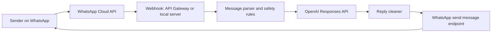

# Personal WhatsApp Reply Agent

A small, maintainable starter repo for a WhatsApp Business Cloud API webhook that replies in a warm, natural, concise style using OpenAI.

Important: this project is for the official WhatsApp Business Platform / Cloud API with a business phone number. WhatsApp does not provide an official API for automating a normal personal WhatsApp account.

## Documentation Map

Use this section to jump to the right guide.

| Need | Document |
| --- | --- |
| Understand what this app does | [Use cases](docs/USE_CASES.md) |
| Product requirements and roadmap | [PRD](docs/PRD.md) |
| Run the project locally | [Local run guide](docs/LOCAL_RUN_GUIDE.md) |
| Test WhatsApp webhooks locally with ngrok | [ngrok guide](docs/NGROK_GUIDE.md) |
| Create Meta WhatsApp token, verify token, and phone number ID | [Meta WhatsApp credentials](docs/META_WHATSAPP_CREDENTIALS.md) |
| Deploy to AWS Lambda and API Gateway | [AWS deployment guide](docs/AWS_DEPLOYMENT.md) |
| General setup notes | [Setup guide](docs/SETUP.md) |

## What This Does

- Receives inbound WhatsApp webhook events.
- Verifies Meta webhook setup with a custom verify token.
- Optionally verifies `X-Hub-Signature-256` using your Meta app secret.
- Generates short, human-sounding replies with OpenAI's Responses API.
- Sends replies through the WhatsApp Cloud API.
- Uses careful fallback replies when the message needs human attention.
- Runs locally with Node.js or as an AWS Lambda handler.

## Architecture



## Local Setup

1. Install Node.js 20 or newer.
2. Create a WhatsApp Business app in Meta for Developers.
3. Copy `.env.example` to `.env`.
4. Fill in:
   - `OPENAI_API_KEY`
   - `WHATSAPP_ACCESS_TOKEN`
   - `WHATSAPP_PHONE_NUMBER_ID`
   - `WHATSAPP_VERIFY_TOKEN`
   - `WHATSAPP_APP_SECRET` if you want signature checks
5. Keep `DRY_RUN=true` for your first local test.
6. Run:

```bash
npm test
npm run check
npm start
npm run package:lambda
```

7. Expose your local server with a tunnel such as ngrok or Cloudflare Tunnel:

```bash
ngrok http 3000
```

8. In Meta webhook settings, set:
   - Callback URL: `https://your-tunnel-url/webhook`
   - Verify token: the same value as `WHATSAPP_VERIFY_TOKEN`

When you are happy with logs and generated replies, set `DRY_RUN=false`.

## AWS Free-Tier-Friendly Deployment

Recommended MVP:

- AWS Lambda for compute.
- API Gateway HTTP API for `/webhook`.
- Environment variables in Lambda configuration.
- CloudWatch logs.

Later production upgrade:

- Put inbound webhook events into SQS first.
- Process SQS messages with Lambda.
- Store idempotency keys and short conversation history in DynamoDB.
- Store secrets in AWS Systems Manager Parameter Store or Secrets Manager.

## Environment Variables

| Name | Purpose |
| --- | --- |
| `OPENAI_API_KEY` | Paid OpenAI API key from the OpenAI dashboard. |
| `OPENAI_MODEL` | Defaults to `gpt-5.5`. Use a smaller model if you prefer lower cost. |
| `WHATSAPP_ACCESS_TOKEN` | Meta token allowed to send WhatsApp messages. |
| `WHATSAPP_PHONE_NUMBER_ID` | Phone number ID shown in WhatsApp API setup. |
| `WHATSAPP_VERIFY_TOKEN` | Your own random secret used by Meta webhook verification. |
| `WHATSAPP_APP_SECRET` | Optional Meta app secret for webhook signature verification. |
| `DRY_RUN` | If `true`, logs replies without sending WhatsApp messages. |
| `AUTO_REPLY` | If `false`, receives webhooks but does not generate/send replies. |
| `HUMAN_REVIEW_NUMBERS` | Sender numbers that should not get AI-generated replies. |

## Useful Commands

```bash
npm test
npm run check
npm start
```

## Project Files

- `src/index.js` - local HTTP server entrypoint.
- `src/lambda.js` - AWS Lambda handler.
- `src/app.js` - webhook processing flow.
- `src/agent/persona.js` - tone and behavior prompt.
- `src/agent/replyAgent.js` - OpenAI Responses API call.
- `src/whatsapp/webhook.js` - Meta webhook parsing.
- `src/whatsapp/client.js` - WhatsApp Cloud API sender.
- `docs/PRD.md` - step-by-step product plan.
- `docs/SETUP.md` - account, key, and deployment setup.
- `docs/LOCAL_RUN_GUIDE.md` - exact local commands for running and testing.
- `docs/META_WHATSAPP_CREDENTIALS.md` - where to get WhatsApp token, verify token, and phone number ID.
- `docs/USE_CASES.md` - plain-English app description and step-by-step use cases.
- `docs/NGROK_GUIDE.md` - why ngrok is used and how to start it.
- `docs/AWS_DEPLOYMENT.md` - complete AWS Lambda and API Gateway deployment steps.

## Compliance Notes

Use this for a real business number and compliant support or communication workflows. Keep human takeover available, avoid medical/legal/financial decisions, and review WhatsApp Business Platform terms before production use.
