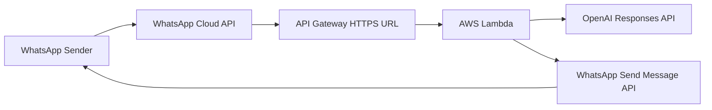

# AWS Deployment Guide

This guide deploys the WhatsApp reply agent to AWS using:

- AWS Lambda for running the Node.js code.
- API Gateway HTTP API for the public HTTPS webhook URL.
- CloudWatch Logs for debugging.

After AWS deployment, you do not need ngrok for production.

## Deployment Architecture



## Before You Start

You need:

- AWS account.
- Meta WhatsApp app.
- WhatsApp access token.
- WhatsApp phone number ID.
- WhatsApp verify token.
- OpenAI API key.
- Node.js 20 or newer on your local machine.

Recommended AWS region:

```text
ap-southeast-1
```

If you are closer to another region, use that region.

## Step 1: Test Locally First

From the project folder:

```bash
cd /Users/akash/Documents/Codex/2026-05-22/write-a-normal-person-are-chatting
npm test
npm run check
npm start
```

In another terminal:

```bash
curl http://localhost:3000/health
```

Deploy only after local health works.

## Step 2: Create Lambda Package

Run:

```bash
npm run package:lambda
```

This creates:

```text
dist/whatsapp-agent.zip
```

This zip contains:

- `package.json`
- `src/`

This project currently has no external runtime dependencies, so there is no `node_modules` folder to upload.

## Step 3: Create Lambda Function

Visit:

```text
https://console.aws.amazon.com/lambda/
```

Steps:

1. Click **Create function**.
2. Choose **Author from scratch**.
3. Function name:

```text
whatsapp-reply-agent
```

4. Runtime:

```text
Node.js 20.x or newer
```

5. Architecture:

```text
x86_64
```

6. Permissions:
   - Choose **Create a new role with basic Lambda permissions**.
7. Click **Create function**.

## Step 4: Configure Lambda Handler

In your Lambda function:

1. Open **Code** tab.
2. Find **Runtime settings**.
3. Click **Edit**.
4. Set handler:

```text
src/lambda.handler
```

5. Save.

Why this handler?

- File: `src/lambda.js`
- Exported function: `handler`

## Step 5: Upload Code Zip

In Lambda:

1. Open **Code** tab.
2. Click **Upload from**.
3. Choose **.zip file**.
4. Upload:

```text
dist/whatsapp-agent.zip
```

5. Click **Save** or **Deploy** if AWS asks.

## Step 6: Set Lambda Environment Variables

In Lambda:

1. Open **Configuration** tab.
2. Open **Environment variables**.
3. Click **Edit**.
4. Add these values:

```bash
OPENAI_API_KEY=sk-your-openai-api-key
OPENAI_MODEL=gpt-5.5
OPENAI_REASONING_EFFORT=low
OPENAI_MAX_OUTPUT_TOKENS=180

WHATSAPP_ACCESS_TOKEN=your-meta-whatsapp-token
WHATSAPP_PHONE_NUMBER_ID=your-whatsapp-phone-number-id
WHATSAPP_VERIFY_TOKEN=your-random-verify-token
WHATSAPP_APP_SECRET=your-meta-app-secret
META_GRAPH_API_VERSION=v23.0

OWNER_NAME=Akash
OWNER_ROLE=Senior Software Engineer
DEFAULT_LANGUAGE=auto
AUTO_REPLY=true
DRY_RUN=true
SEND_READ_RECEIPTS=false
REPLY_WITH_CONTEXT=false
HUMAN_REVIEW_NUMBERS=
```

Start with:

```bash
DRY_RUN=true
```

This logs the reply but does not send real WhatsApp messages.

## Step 7: Set Timeout and Memory

In Lambda:

1. Open **Configuration** tab.
2. Open **General configuration**.
3. Click **Edit**.
4. Set:

```text
Memory: 256 MB
Timeout: 15 seconds
```

5. Save.

You can increase timeout later if OpenAI or WhatsApp calls need more time.

## Step 8: Create API Gateway HTTP API

Visit:

```text
https://console.aws.amazon.com/apigateway/
```

Steps:

1. Click **Create API**.
2. Under **HTTP API**, click **Build**.
3. Click **Add integration**.
4. Choose **Lambda**.
5. Select your region.
6. Select function:

```text
whatsapp-reply-agent
```

7. API name:

```text
whatsapp-reply-agent-api
```

8. Create routes:

```text
GET /health
GET /webhook
POST /webhook
```

9. Attach all three routes to the same Lambda integration.
10. Use the `$default` stage with auto-deploy enabled.
11. Click **Create**.

AWS will show an invoke URL like:

```text
https://abc123.execute-api.ap-southeast-1.amazonaws.com
```

Your production webhook URL becomes:

```text
https://abc123.execute-api.ap-southeast-1.amazonaws.com/webhook
```

## Step 9: Test AWS Health URL

Run:

```bash
curl https://abc123.execute-api.ap-southeast-1.amazonaws.com/health
```

Expected response:

```json
{"ok":true,"dryRun":true,"autoReply":true}
```

If this fails, check CloudWatch Logs for the Lambda function.

## Step 10: Test AWS Webhook Verification

Replace URL and token:

```bash
curl "https://abc123.execute-api.ap-southeast-1.amazonaws.com/webhook?hub.mode=subscribe&hub.verify_token=your-token&hub.challenge=hello123"
```

Expected response:

```text
hello123
```

If this works, Meta webhook verification should work.

## Step 11: Connect AWS URL to Meta WhatsApp Webhook

Visit:

```text
https://developers.facebook.com/apps/
```

Steps:

1. Open your Meta app.
2. Go to **WhatsApp > Configuration** or **Webhooks**.
3. Edit callback URL.
4. Callback URL:

```text
https://abc123.execute-api.ap-southeast-1.amazonaws.com/webhook
```

5. Verify token:

```text
same value as WHATSAPP_VERIFY_TOKEN
```

6. Click **Verify and Save**.
7. Subscribe to the WhatsApp `messages` field.

## Step 12: Test With WhatsApp

1. Keep `DRY_RUN=true`.
2. Send a WhatsApp message to your WhatsApp Business test number.
3. Open AWS CloudWatch Logs.
4. Check that the app logs `dry_run_reply`.

If the dry-run reply looks good, continue.

## Step 13: Enable Real Replies

In Lambda environment variables, change:

```bash
DRY_RUN=false
```

Save the Lambda configuration.

Send another WhatsApp test message. The app should now send the generated reply through WhatsApp Cloud API.

## Step 14: Update Deployment Later

When you change code:

```bash
npm test
npm run check
npm run package:lambda
```

Then upload:

```text
dist/whatsapp-agent.zip
```

to the same Lambda function again.

## Optional: Update Lambda Code With AWS CLI

Install and configure AWS CLI first:

```bash
aws configure
```

After the Lambda function already exists, package and update code:

```bash
npm run package:lambda
aws lambda update-function-code \
  --function-name whatsapp-reply-agent \
  --zip-file fileb://dist/whatsapp-agent.zip
```

Update environment variables from CLI only if you are comfortable handling secrets in terminal history. For production secrets, use AWS Systems Manager Parameter Store or AWS Secrets Manager.

## Cost Control

Recommended:

- Create an AWS billing budget.
- Create a billing alarm.
- Use Lambda, API Gateway, and CloudWatch only for the MVP.
- Avoid EC2.
- Avoid NAT Gateway.
- Set CloudWatch log retention to 7 or 14 days.
- Keep `OPENAI_MAX_OUTPUT_TOKENS` low.

## Production Hardening

Before real production use:

- Use a permanent Meta system-user token.
- Set `WHATSAPP_APP_SECRET`.
- Store secrets in AWS Secrets Manager or Systems Manager Parameter Store.
- Add DynamoDB for duplicate message storage.
- Add SQS so API Gateway can acknowledge Meta immediately.
- Add CloudWatch alarms for Lambda errors.
- Add a manual review process for sensitive messages.
- Keep `HUMAN_REVIEW_NUMBERS` configured for important contacts.

## Troubleshooting

### `/health` returns 404

Check API Gateway route:

```text
GET /health
```

It must point to the Lambda integration.

### Meta webhook verification fails

Check:

- API URL ends with `/webhook`.
- Route `GET /webhook` exists.
- `WHATSAPP_VERIFY_TOKEN` in Lambda exactly matches Meta.
- Lambda handler is `src/lambda.handler`.

### Webhook returns 401 Invalid signature

If `WHATSAPP_APP_SECRET` is set, signature verification is enabled.

For manual curl testing, remove `WHATSAPP_APP_SECRET` temporarily or test through Meta. Do not disable signature verification in production unless you understand the risk.

### Message comes in but no reply is sent

Check Lambda environment:

```bash
AUTO_REPLY=true
DRY_RUN=false
WHATSAPP_ACCESS_TOKEN=...
WHATSAPP_PHONE_NUMBER_ID=...
OPENAI_API_KEY=...
```

Also check CloudWatch Logs for OpenAI or WhatsApp API errors.

### Lambda times out

Increase timeout to 20 or 30 seconds. For production, add SQS so the webhook can return quickly.
