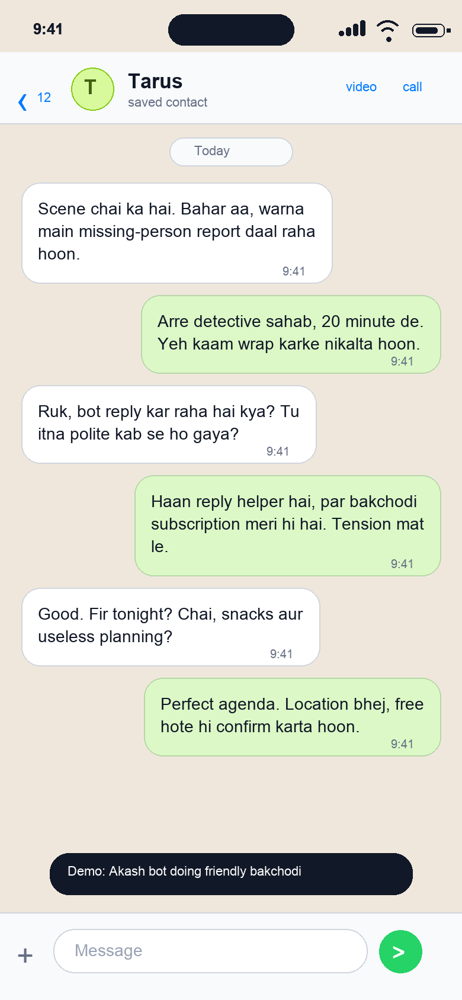

# iPhone 13 Tarus Hindi Bakchodi Demo

This demo shows a realistic mock iPhone 13 WhatsApp-style conversation in Roman Hindi/Hinglish.

Scenario:

- Contact name: `Tarus`
- Relationship: close friend
- Tone: full friendly bakchodi, casual, funny
- Owner: Akash
- Behavior: bot replies on Akash's behalf, but still sounds like Akash
- Safety: mock conversation only, no real phone number or private data

## Screen Recording Video Files

- [MOV video](assets/iphone13-tarus-hindi-bakchodi-demo.mov)
- [M4V video](assets/iphone13-tarus-hindi-bakchodi-demo.m4v)

## Preview GIF


Poster image:



## Conversation Example

Tarus:

```text
Bhai, zinda hai ya laptop ne tujhe permanent adopt kar liya?
```

Bot replying as Akash:

```text
Zinda hoon bhai. Laptop thoda chipku hai, par main bhaag ke aaya. Bol kya scene hai?
```

Tarus:

```text
Scene chai ka hai. Bahar aa, warna main missing-person report daal raha hoon.
```

Bot replying as Akash:

```text
Arre detective sahab, 20 minute de. Yeh kaam wrap karke nikalta hoon.
```

Tarus:

```text
Ruk, bot reply kar raha hai kya? Tu itna polite kab se ho gaya?
```

Bot replying as Akash:

```text
Haan reply helper hai, par bakchodi subscription meri hi hai. Tension mat le.
```

Tarus:

```text
Good. Fir tonight? Chai, snacks aur useless planning?
```

Bot replying as Akash:

```text
Perfect agenda. Location bhej, free hote hi confirm karta hoon.
```

## Behavior Notes

1. Keep the reply short and funny.
2. Match the friend's bakchodi energy.
3. Use Roman Hindi/Hinglish for natural WhatsApp style.
4. Stay honest if asked whether a helper is replying.
5. Avoid making real commitments unless Akash configured them.

## Regenerate the Hindi Demo

Run:

```bash
/Users/akash/.cache/codex-runtimes/codex-primary-runtime/dependencies/python/bin/python3 scripts/generate_iphone13_tarus_demo.py hindi
CLANG_MODULE_CACHE_PATH=/private/tmp/swift-module-cache swift scripts/png_sequence_to_mov.swift tmp/iphone13-tarus-hindi-video-frames docs/assets/iphone13-tarus-hindi-bakchodi-demo.mov 3 780 1688
avconvert --source docs/assets/iphone13-tarus-hindi-bakchodi-demo.mov --preset PresetHighestQuality --output docs/assets/iphone13-tarus-hindi-bakchodi-demo.m4v --replace
```

Output files:

```text
docs/assets/iphone13-tarus-hindi-bakchodi-demo.gif
docs/assets/iphone13-tarus-hindi-bakchodi-demo.mov
docs/assets/iphone13-tarus-hindi-bakchodi-demo.m4v
docs/assets/iphone13-tarus-hindi-bakchodi-poster.png
```
