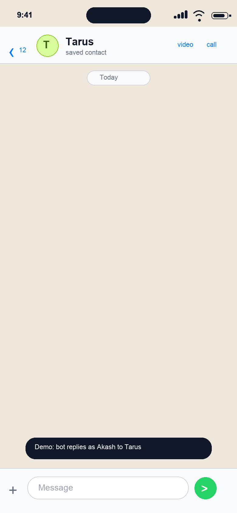
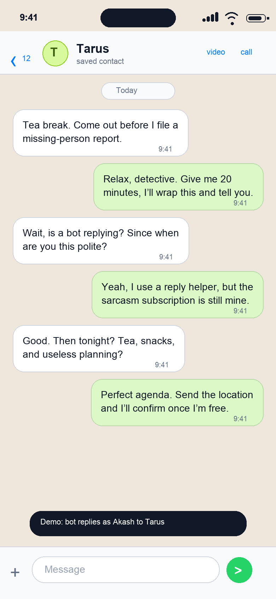

# iPhone 13 Tarus Screen Recording Demo

This demo shows a realistic mock iPhone 13 WhatsApp conversation.

Scenario:

- Contact name: `Tarus`
- Relationship: friend
- Tone: playful, casual, friendly English
- Owner: Akash
- Behavior: bot replies on Akash's behalf, but still sounds natural
- Safety: mock conversation only, no real phone number or private data

## Demo GIF



## Screen Recording Video Files

- [MOV video](assets/iphone13-tarus-realtime-demo.mov)
- [M4V video](assets/iphone13-tarus-realtime-demo.m4v)

Poster image:



## Conversation Example

Tarus:

```text
Bro, are you alive or lost inside code again?
```

Bot replying as Akash:

```text
Haha I’m alive. Got pulled into work for a bit. What’s the scene?
```

Tarus:

```text
Tea break. Come out before I file a missing-person report.
```

Bot replying as Akash:

```text
Relax, detective. Give me 20 minutes, I’ll wrap this and tell you.
```

Tarus:

```text
Is a bot replying? Since when are you this polite?
```

Bot replying as Akash:

```text
Yeah, I use a reply helper, but the tone is mine. Don’t worry, nonsense mode is still on.
```

Tarus:

```text
Good. Then tonight? Tea, snacks, and useless planning?
```

Bot replying as Akash:

```text
Perfect agenda. Send the location and I’ll confirm once I’m free.
```

## How the Bot Should Behave With a Fun Friend

1. Keep the reply short.
2. Match the friend's playful energy.
3. Use casual English when the friend is joking.
4. Do not over-explain.
5. Stay honest if asked whether a helper is replying.
6. Avoid commitments unless Akash clearly configured them.

## Regenerate the Demo

Run:

```bash
/Users/akash/.cache/codex-runtimes/codex-primary-runtime/dependencies/python/bin/python3 scripts/generate_iphone13_tarus_demo.py
CLANG_MODULE_CACHE_PATH=/private/tmp/swift-module-cache swift scripts/png_sequence_to_mov.swift tmp/iphone13-tarus-video-frames docs/assets/iphone13-tarus-realtime-demo.mov 3 780 1688
avconvert --source docs/assets/iphone13-tarus-realtime-demo.mov --preset PresetHighestQuality --output docs/assets/iphone13-tarus-realtime-demo.m4v --replace
```

Output files:

```text
docs/assets/iphone13-tarus-realtime-demo.gif
docs/assets/iphone13-tarus-realtime-demo.mov
docs/assets/iphone13-tarus-realtime-demo.m4v
docs/assets/iphone13-tarus-realtime-poster.png
```
