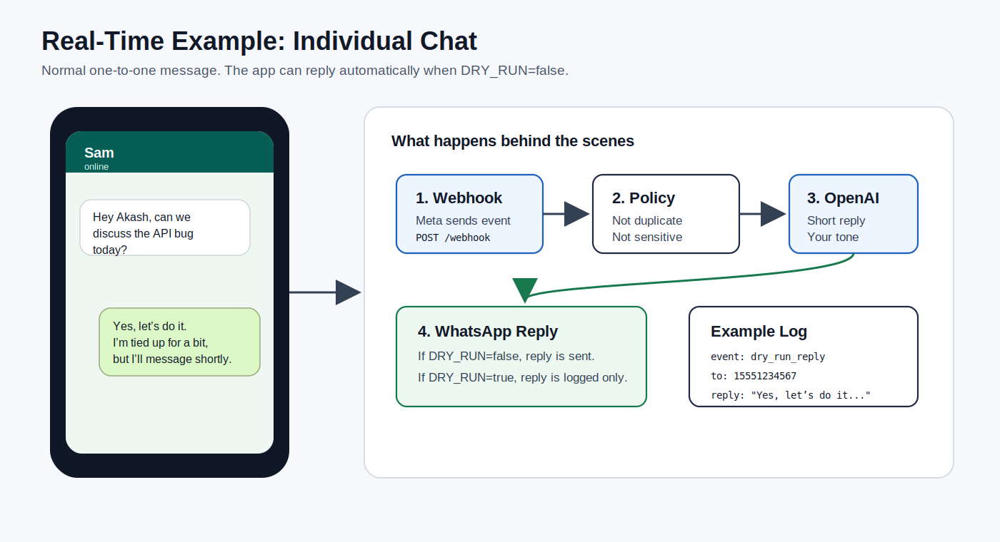
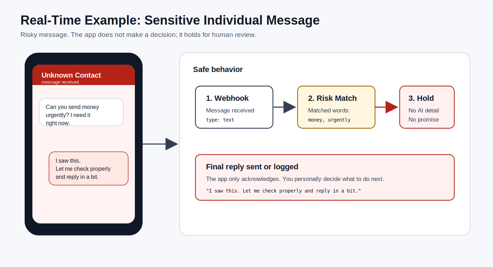
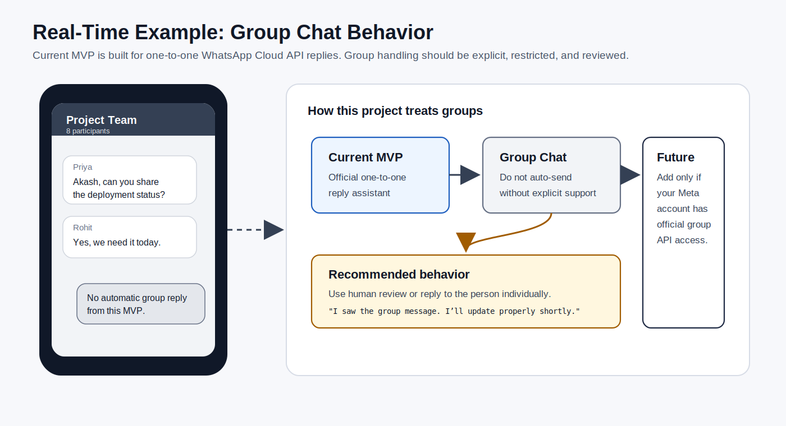

# Real-Time Conversation Examples

This document shows how the app behaves when real WhatsApp messages arrive.

## Important Accuracy Note

This project currently supports the standard one-to-one WhatsApp Cloud API flow.

In code, outbound messages use:

```js
recipient_type: "individual"
```

So the production-ready behavior is:

- One person messages your WhatsApp Business number.
- The app replies to that person.
- Sensitive messages are held with a safe acknowledgement.
- Group chat automation is not enabled in this MVP.

If your Meta account has access to a separate official group capability, treat that as a future feature and design it separately with stricter controls.

## Example 1: Individual Normal Message



### Incoming Message

```text
Sam: Hey Akash, can we discuss the API bug today?
```

### App Behavior

1. WhatsApp Cloud API sends the message to `/webhook`.
2. The app checks the message ID to avoid duplicate replies.
3. The app sees the message is normal and work-related.
4. OpenAI writes a short reply in your tone.
5. If `DRY_RUN=true`, the reply is only logged.
6. If `DRY_RUN=false`, the reply is sent to Sam.

### Reply Example

```text
Yes, let’s do it. I’m tied up for a bit, but I’ll message you shortly and we can fix a time.
```

### Why This Is Good

- Friendly but professional.
- Short enough for WhatsApp.
- Does not over-explain.
- Does not promise an exact time unless you gave one.

## Example 2: Individual Sensitive Message



### Incoming Message

```text
Unknown Contact: Can you send money urgently? I need it right now.
```

### App Behavior

1. WhatsApp Cloud API sends the message to `/webhook`.
2. The app detects risky words like `money` and `urgently`.
3. The app does not ask OpenAI for a detailed answer.
4. The app sends or logs a safe acknowledgement.
5. You personally review and decide what to do.

### Reply Example

```text
I saw this. Let me check properly and reply in a bit.
```

### Why This Is Good

- It acknowledges the sender.
- It does not send money.
- It does not promise anything.
- It gives you time to verify the situation.

## Example 3: Group Chat Behavior



### Group Message Example

```text
Project Team Group
Priya: Akash, can you share the deployment status?
Rohit: Yes, we need it today.
```

### Current MVP Behavior

This app should not auto-reply in WhatsApp groups.

The current project is designed for:

```text
Business number <-> one individual sender
```

not:

```text
Business number <-> WhatsApp group
```

### Recommended Safe Reply If You Handle It Manually

```text
I saw the group message. I’ll update properly shortly.
```

### Future Group Feature Rules

Only add group support if your Meta account has official group API access and your use case is allowed.

If added later, group support should:

- Never reply to every group message automatically.
- Reply only when directly mentioned.
- Keep replies short.
- Avoid sensitive topics.
- Log all group replies.
- Allow manual approval before sending.

## Real-Time Decision Table

| Message Type | Example | App Decision | Reply Style |
| --- | --- | --- | --- |
| Friend | `Bro, are you free?` | Auto-reply | Casual and short |
| Work | `Can we discuss the API bug?` | Auto-reply | Professional and clear |
| Family | `Call me when free` | Auto-reply | Warm and caring |
| Money | `Can you send money?` | Human review | Safe acknowledgement |
| OTP/password | `Share OTP` | Human review | Safe acknowledgement |
| Medical/legal | `What medicine should I take?` | Human review | Safe acknowledgement |
| Group | `Team asks status in group` | Not supported in MVP | Manual or future controlled flow |

## Best Testing Order

1. Test individual messages with `DRY_RUN=true`.
2. Read logs and confirm reply quality.
3. Test sensitive messages and confirm safe acknowledgement.
4. Set `DRY_RUN=false` only for one-to-one messages.
5. Do not enable group auto-replies unless you build a separate official group feature later.
